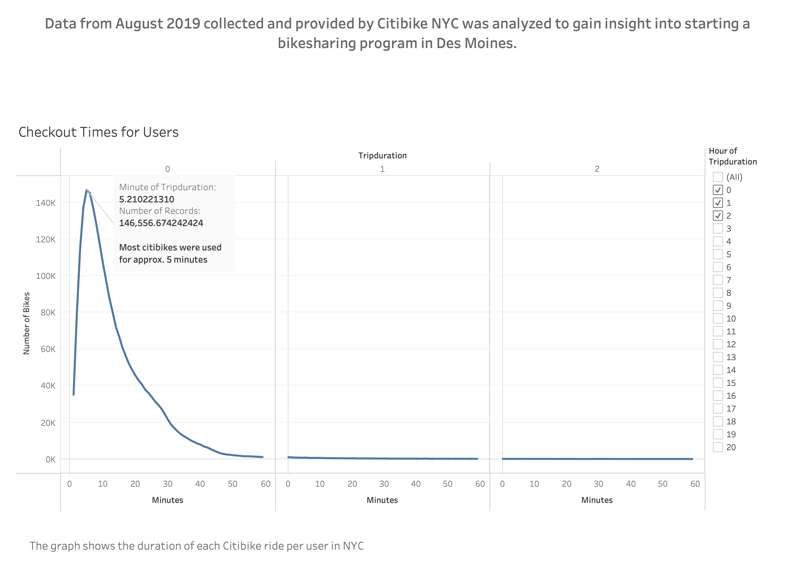
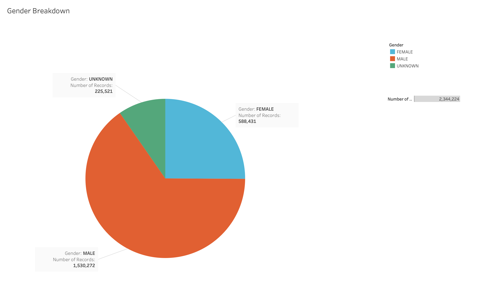
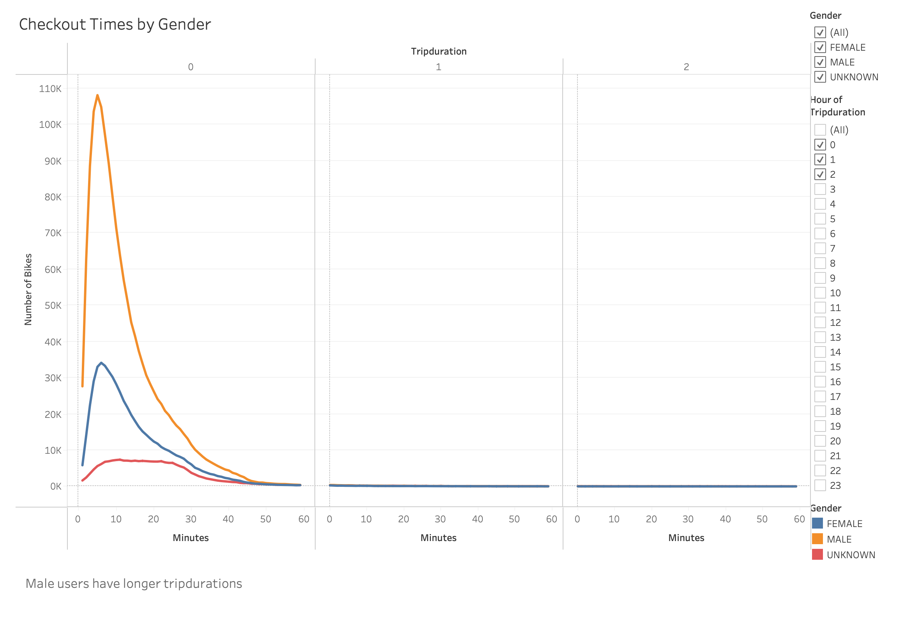
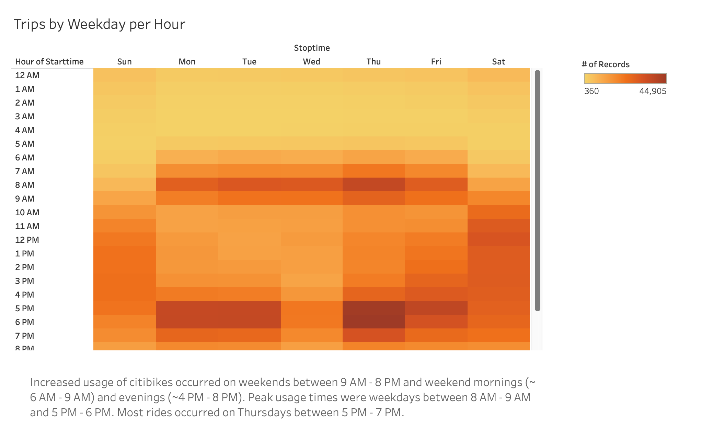
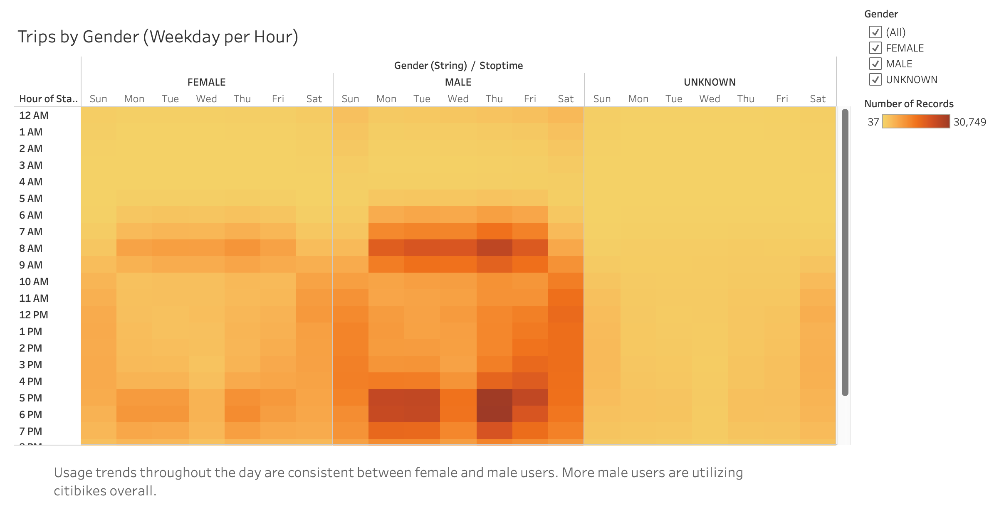
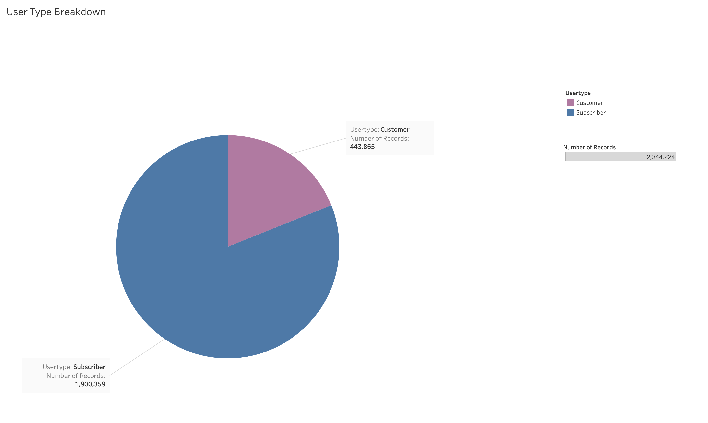
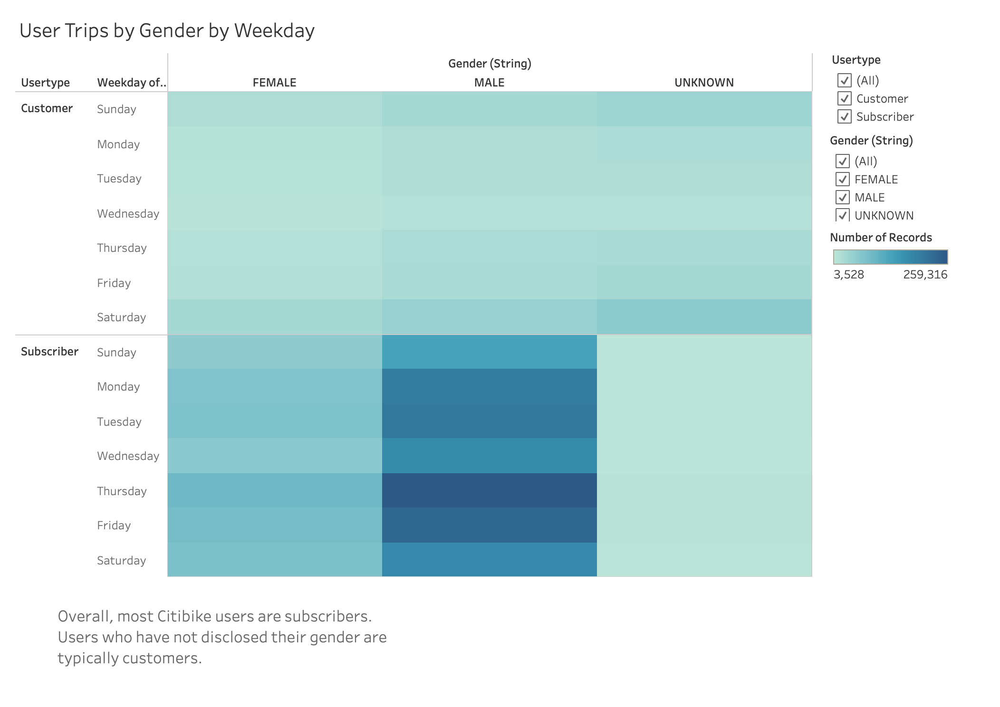

# NYC Citibike Analysis

[link to dashboard](https://public.tableau.com/shared/S4874FH8Y?:display_count=n&:origin=viz_share_link "link to dashboard")

## Overview of the Analysis:
The purpose of this analysis is to gain an understanding of the success of Citibike in New York to convince investors that a similar ride sharing program can be implemented in Des Moines. 

The data is presented using visualizations in Tableau so the information can be easily communicated to stakeholders. 

## Results

**Checkout Times for Users**

This graph shows the tripdurations of NYC Citibike users. The majority of riders use bikes for under 20 minutes and the most users used the citibikes for about 5 minutes.

**Gender Breakdown**

This pie chart is included to give users an overall idea of the breakdown between female and male users. There are other diagrams that display data by gender so this may help show viewers how many more male users are users of Citibike services there are than female users. 

**Checkout Times for Users by Gender**
 
The next visualization shows the same tripdurations per user by gender. This shows similar patterns in use times between men and women, but that men are higher utilizers of the ride sharing service. 

**Trips by Weekday per Hour**

The heatmap chart displays the dates and times throughout the week in which citibikes are used the most. The darker the point in the table represents higher frequency of use. This visualization easily allows viewer to determine the popular times for the ride sharing service. 

**Trips by Weekday per Hour by Gender**

Again this graph is a similar depiction of the previous visualization with the added element of distributing users by gender. Female and male users have similar days and times that they use citibikes. Since there are more male users, the colors are darker on the male graph. 

**User Breakdown**

Similar to the gender breakdown, this pie chart shows potential investors the amount of subscribers versus customers. This may provide context for the next visualization that shows the user trips by gender and user type. 

**User Trips by Gender**

This visualization displays the distribution of user types by day and gender. There are a few insights gained from this visualization. Most citibike users throughout the week are subscribers, which are frequent users who commit to using the service through the subscription model compared to customers who are users who purchase a one-time or limited pass to use the bike. Most customers who use the service use the bikes on weekends. This is most likely not a normal mode of transportation so bikes could be used for weekend-activities or tourists. 

## Summary
The data from NYC Citibike provides insight into how the business works and allows investors to see the success of a ride sharing business in New York to see how it can be modeled in Des Moines. Gaining an understanding of the user demographics is important to see how that would translate in a different city. Overall, NYC Citibike has built a great user reach and has established a large subscription user base. In August 2019, NYC Citibike had 1.9 million subscribers and about 500,000 customers. Male users are the majority of NYC Citibike users with 1.5 million being male and about 600,000 being female and 225,000 being unknown. Furthermore, understanding when and how users interact with the business is important. In NYC, there are a lot of users using the bikes for short periods of time, usually under 20 minutes. Based on the trips by weekday per hour visualization, the bikes are used most often on weekends and commuting hours during the week (6 - 10 AM, 4 - 8 PM). This may suggest people are using bikes to commute to and from work, for leisure, and or errands on weekends. Investors can see how this data can translate to the success of a ride sharing program in Des Moines. Understanding bike laws and road sharing in Des Moines can help investors feel confident that people will feel comfortable using bikes as a regular mode of transportation. Understanding the purpose of using bikes will help guide marketing campaigns to ensure the target audience(s) are reached. The knowledge gained from the data of a successful ride sharing program provides valuable insight into the prospect of implementing a similar program in Des Moines.